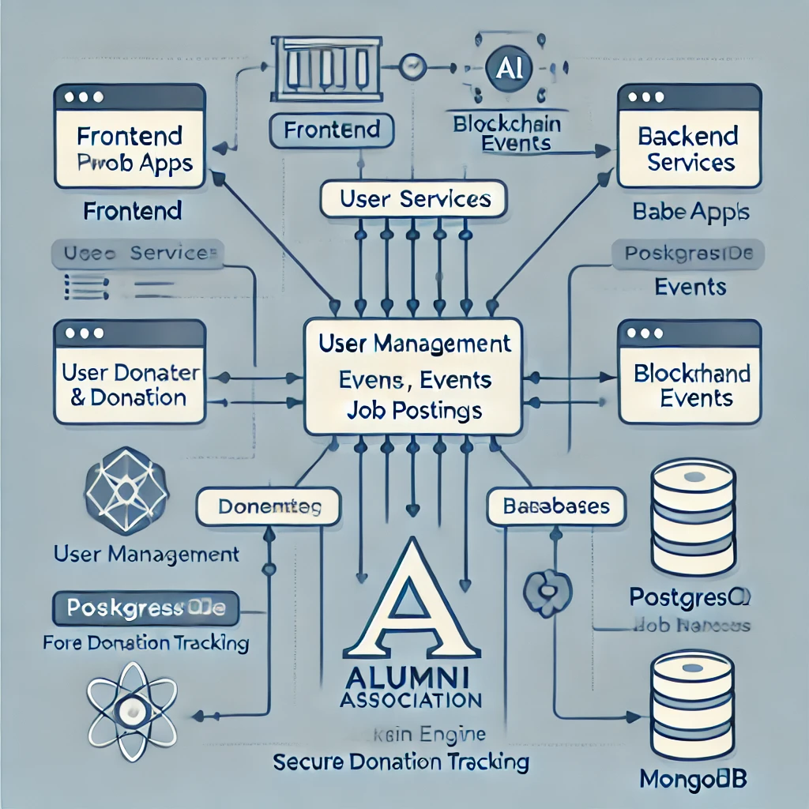

# Smart India Hackathon Workshop
# Date: 28-11-2024
## Register Number: 24900276
## Name: Keerthivasan KS
## Problem Title
Implementation of the Alumni Association platform for the University/Institute.
## Problem Description
Background: Alumni associations play a pivotal role in fostering lifelong connections between graduates and their alma mater, facilitating networking, mentorship, and philanthropic support. However, many alumni associations face challenges in maintaining engagement, facilitating donations, and providing valuable services such as job networking and tracking alumni success stories. A comprehensive Alumni Association platform for a University/Institute, encompassing both web and mobile applications, aims to address these challenges effectively. Detailed Description: The proposed Alumni Association platform for the Government Engineering College will feature robust functionalities accessible through both web and mobile applications: Alumni Registration: User-friendly registration processes on both web and mobile platforms, allowing alumni to join the association, update their profiles, and stay connected with peers and the institution. Donation Portal: Secure mechanisms on both platforms for alumni to contribute donations easily and support various initiatives and projects undertaken by the college, fostering a culture of philanthropy. Networking Hub: Dedicated sections on both platforms to connect alumni based on shared interests, professions, and geographic locations, facilitating professional networking, mentorship, and collaboration opportunities. Job Portal: Integrated job search and posting features accessible via web and mobile apps, enabling alumni to explore career opportunities, post job openings, and connect with potential employers within the alumni network. Alumni Directory: Search functionalities available on both platforms to find alumni based on different criteria such as graduation year, field of study, industry, location, etc., promoting networking and community building. Success Story Tracking: Features on both web and mobile apps to showcase and track alumni achievements, success stories, and notable contributions to society, inspiring current students and fostering pride among alumni. Events and Reunions: Announcements, registrations, and management tools available on both platforms for organizing alumni events, reunions, workshops, and professional development sessions to maintain engagement and connection. Feedback and Surveys: Channels on both web and mobile apps for alumni to provide feedback on their experiences, suggest improvements, and participate in surveys to help shape future initiatives of the association. The platform will prioritize user experience, security, and scalability across both web and mobile applications to cater to the diverse needs of the Government Engineering College's alumni community. Expected Solution: Implementation of the Alumni Association platform for the Government Engineering College, comprising both web and mobile applications, is expected to achieve several positive outcomes: Enhanced Alumni Engagement: Seamless access to networking, career opportunities, and alumni events through web and mobile apps will strengthen connections among alumni, fostering a vibrant and active community. Increased Philanthropic Support: Convenient donation processes accessible via both platforms will encourage alumni to contribute towards the college's growth and development initiatives. Career Advancement: Access to job postings, mentorship opportunities, and professional networking on mobile devices will support alumni in their career growth and advancement. Knowledge Sharing: Exchange of knowledge, experiences, and best practices facilitated through both web and mobile apps will enrich professional development and lifelong learning initiatives. Pride and Recognition: Highlighting alumni achievements and success stories on both platforms will instill pride in the alma mater and inspire current students to excel in their academic and professional pursuits. Community Building: Interactive features available on both web and mobile apps will nurture a sense of belonging and camaraderie among alumni, strengthening their bond with the institution. In summary, the Alumni Association platform for the University/Institute, integrated with both web and mobile applications, aims to create a dynamic and supportive ecosystem where alumni can connect, contribute, and thrive, thereby enriching the overall educational experience and legacy of the institution.
## Problem Creater's Organization
Government of Gujarat

## Idea
The **Alumni Association Platform** is a web and mobile application designed to foster lifelong connections among alumni, current students, and the institution. This platform serves as a hub for networking, mentoring, job opportunities, event management, and philanthropic contributions. Leveraging modern technologies like AI, blockchain, and microservices, the solution ensures a secure, personalized, and scalable ecosystem.

---

## **Project Features**
1. **AI-powered Networking**:
   - Recommends connections and mentors based on shared interests, career paths, and location.
   - Real-time sentiment analysis to improve alumni engagement.

2. **Decentralized Donations**:
   - Blockchain-based donation system with transparent allocation tracking.
   - Impact visualization for donors showing real-time updates on funded projects.

3. **Smart Job Portal**:
   - Alumni can post and apply for jobs with verified credentials.
   - AI-driven job recommendations based on profiles and skillsets.

4. **Event Management**:
   - Hybrid event hosting with live streaming, reminders, and analytics.
   - Integrated calendar sync for event reminders.

5. **Interactive Directory**:
   - Advanced filters (year, location, profession) and real-time geospatial mapping of alumni.
   - Integration with LinkedIn APIs for automatic profile updates.

6. **Gamified Engagement**:
   - Alumni earn engagement tokens for surveys, mentorship, and events.
   - Tokens can be redeemed for exclusive benefits (e.g., merchandise, priority access).

---


## Proposed Solution / Architecture Diagram


### **Components**:
1. **Frontend (Web and Mobile Apps)**:
   - User Interface for alumni, admin, and recruiters.
2. **Backend Services**:
   - Microservices for user management, donations, events, and job postings.
3. **Blockchain Node**:
   - For decentralized identity verification and transparent donations.
4. **AI Engine**:
   - For recommendations, sentiment analysis, and engagement tracking.
5. **Database**:
   - Primary (PostgreSQL) for structured data.
   - Secondary (MongoDB) for flexible alumni activity logs.

---

## Use Cases

### **Actors**:
- **Alumni**: Access features like registration, networking, jobs, and donations.
- **Admin**: Manage events, verify alumni, and analyze engagement.
- **Recruiters**: Post jobs, search for potential hires, and organize events.
- **Students**: Seek mentorship, access the job portal, and participate in events.

### **Key Use Cases**:
1. Alumni Registration and Profile Updates.
2. Donation Management with Blockchain.
3. Event Creation, Registration, and Participation.
4. Job Posting and Application.
5. Mentorship Pairing and Networking.
6. Feedback and Sentiment Analysis.

---


## Technology Stack
### **Frontend**
- **Web**: React.js with Material-UI for responsive design.
- **Mobile**: Flutter for cross-platform app development.

### **Backend**
- **Node.js** with Express.js: For building scalable REST APIs.
- **GraphQL**: For efficient querying and data fetching.

### **Database**
- **PostgreSQL**: Relational database for core data storage.
- **MongoDB**: NoSQL database for unstructured data like activity logs.
- **Redis**: Caching layer for faster access to frequently queried data.

### **Blockchain**
- **Ethereum**: Smart contracts for decentralized donation tracking.
- **IPFS**: Decentralized file storage for alumni credentials and event materials.

### **AI & Analytics**
- **PyTorch/TensorFlow**: For building AI models for recommendation systems.
- **Apache Kafka**: For real-time data processing and analytics.

### **Cloud & Deployment**
- **AWS/GCP**: Cloud hosting, storage, and machine learning services.
- **Docker**: For containerized deployments.
- **Kubernetes**: For scaling microservices.

---

## Dependencies
### **Frontend**
1. **React.js Libraries**:
   - `react-router-dom`: For routing.
   - `axios`: For API communication.
2. **Flutter Plugins**:
   - `flutter_bloc`: For state management.
   - `firebase_auth`: For authentication.

### **Backend**
1. **Node.js Modules**:
   - `jsonwebtoken`: For authentication.
   - `express-validator`: For input validation.
2. **Blockchain**:
   - `web3.js`: For interacting with Ethereum blockchain.
3. **GraphQL Tools**:
   - `apollo-server-express`: For building GraphQL APIs.

### **Database**
- **PostgreSQL Drivers**: `pg` for Node.js integration.
- **MongoDB Drivers**: `mongoose` for object modeling.

### **AI Frameworks**
- **PyTorch**: For building recommendation systems.
- **NLTK**: For natural language processing tasks like sentiment analysis.

### **DevOps**
- **Docker**: To package applications in containers.
- **Jenkins**: For continuous integration and deployment.

---

## **Installation**
1. Clone the repository:
   ```bash
   git clone https://github.com/selvasachein/SIHPS.git
   ```
2. Navigate to the project folder and set up dependencies.

3. Run the backend:
   ```bash
   cd backend
   npm install
   npm start
   ```

4. Run the frontend:
   ```bash
   cd frontend
   npm install
   npm start
   ```

5. For mobile app:
   ```bash
   cd mobile
   flutter pub get
   flutter run
   ```

---

## **Contributing**
Contributions are welcome! Please read the [CONTRIBUTING.md](CONTRIBUTING.md) file for details on the process for submitting pull requests.

---

## **License**
This project is licensed under the MIT License - see the [LICENSE](LICENSE) file for details.

